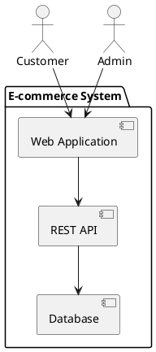
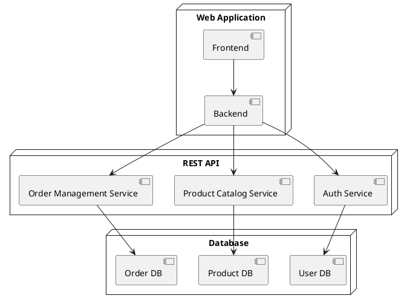
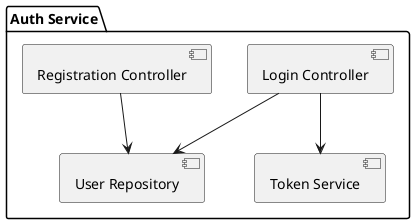
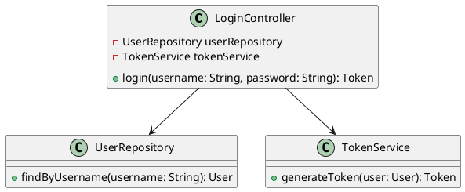

# C4 Model Overview

The C4 model provides four different perspectives, or levels of abstraction, to represent software architecture. Each perspective focuses on different aspects of the system and is tailored to different audiences.

## 1. Context Diagram
**Perspective**: High-level external view.  
**Focus**: The system's environment and its interactions with external entities (such as users, other systems, and external services).  
**Audience**: Non-technical stakeholders (e.g., business sponsors, end-users).

### Example

## 2. Container Diagram
**Perspective**: High-level internal view.  
**Focus**: The main containers (applications or services) that make up the system, their responsibilities, and their interactions.  
**Audience**: Both technical and non-technical stakeholders who need an understanding of the system’s structure.

### Example

## 3. Component Diagram
**Perspective**: Mid-level internal view.  
**Focus**: The components within each container, their responsibilities, and interactions.  
**Audience**: Developers and architects who need detailed information on the internals of each container.

### Example

## 4. Code (or Class) Diagram
**Perspective**: Low-level internal view.  
**Focus**: The internal structure of the components, typically represented by classes, interfaces, and their relationships.  
**Audience**: Developers working on the implementation of the system.

### Example

---

## Summary of the C4 Model Perspectives
- **Context Diagram**: Provides a broad, high-level view of the system in its environment, highlighting interactions with external actors.
- **Container Diagram**: Breaks the system into high-level containers and shows how they interact within the system.
- **Component Diagram**: Zooms into a specific container to show the internal components and their interactions.
- **Code Diagram**: Offers the most detailed view, focusing on the internal structure of the components at the code level.

By using these four perspectives, the C4 model allows for a comprehensive understanding of the software architecture at different levels of detail, making it easier to communicate with various stakeholders and ensuring that the architecture is well-documented and understood.