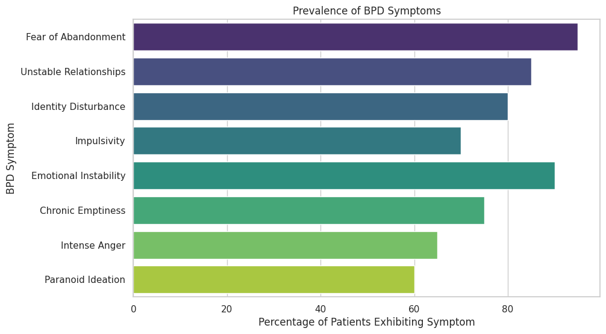

# Understanding Borderline Personality Disorder (BPD)

## Overview of BPD

### Definition:
- A mental health disorder characterized by pervasive patterns of instability in emotions, self-image, behavior, and relationships.

### Core Symptoms:
- Intense fear of abandonment.
- Unstable interpersonal relationships.
- Identity disturbance.
- Impulsivity.
- Emotional instability.
- Chronic feelings of emptiness.
- Inappropriate, intense anger.
- Transient, stress-related paranoid ideation or severe dissociative symptoms.

### Prevalence:
- Affects about 1.6% of the general population.
- More common in women than men.

## Causes and Risk Factors

### Genetic Factors:
- Family history of BPD or other mental health disorders.

### Neurobiological Factors:
- Abnormalities in brain regions that regulate emotion and behavior.

### Environmental Factors:
- Childhood trauma and abuse.
- Neglect and separation from caregivers.

## Symptoms and Diagnosis

### Diagnostic Criteria:
Per DSM-5, at least five of the following symptoms:
- Efforts to avoid real or imagined abandonment.
- A pattern of unstable and intense interpersonal relationships.
- Identity disturbance.
- Impulsivity in at least two areas that are potentially self-damaging.
- Recurrent suicidal behavior, gestures, or threats.
- Affective instability.
- Chronic feelings of emptiness.
- Inappropriate, intense anger.
- Transient, stress-related paranoid ideation or severe dissociative symptoms.

### Impact on Life:
- Severe interpersonal difficulties.
- High rates of comorbid conditions like depression, anxiety, and substance abuse.

## Treatment and Management

### Therapeutic Approaches:
- Dialectical Behavior Therapy (DBT).
- Cognitive Behavioral Therapy (CBT).
- Schema-focused therapy.

### Medications:
- No specific medication for BPD.
- Medications may be used to treat co-occurring conditions like depression or anxiety.

### Support Systems:
- Importance of a strong support network.
- Family education and involvement in therapy.

## Relationship with Bipolar Disorder

### Similarities and Differences:
- Both involve mood instability but differ in patterns and triggers.

### Family History:
- Having a family member with bipolar disorder can increase vulnerability to BPD.

## Impact of Trauma and Stress on BPD

### Pre-existing Vulnerabilities:
- Genetic, neurobiological, and early environmental factors can create a predisposition to BPD.

### Role of Trauma:
- Early trauma, such as abuse or neglect, is strongly linked to BPD development.

### Stress and Symptom Exacerbation:
- High levels of stress and significant life events can intensify BPD symptoms.

## Intensification of BPD Symptoms

### Emotional Dysregulation:
- Trauma and stress amplify emotional dysregulation, leading to severe mood swings.

### Increased Use of Defense Mechanisms:
- Under stress, reliance on maladaptive defense mechanisms like splitting and projection increases.

### Heightened Fear of Abandonment:
- Stressful events exacerbate the fear of abandonment, resulting in turbulent relationships and impulsive behaviors.

## Framework of Thinking and Ego Regulation

### Trauma Impact on Ego:
- Trauma disrupts normal ego functioning, making emotional regulation difficult.

### Development of BPD Framework:
- Individuals adopt a BPD framework as a coping mechanism, characterized by black-and-white thinking and unstable relationships.

### Ego Defense and Trauma Response:
- Defense mechanisms become entrenched, contributing to further emotional dysregulation and relational difficulties.

## Mental Illness as Ego Defense Mechanism

### Understanding Mental Illness:
- Mental illness can be seen as an ego defense mechanism, where the mind develops certain behaviors and patterns to protect itself from perceived threats.
- Everyone has unique frameworks of thinking that can be managed with the right tools and therapy.

### Therapy and Tools:
- Therapy helps individuals understand their mental framework and find tools that work for them.
- Thinking of mental illness as a universal human experience can reduce stigma and make it more relatable.

### Cultural Impact:
- Society's understanding of mental illness is evolving, but cultural constructs still influence perceptions and treatment of mental health conditions.

## Summary
Trauma and Stress: Trauma and significant stress can activate and intensify symptoms of BPD, leading to a cycle of emotional instability and maladaptive coping mechanisms.

## Code Example
[Jupyter Notebook](https://colab.research.google.com/drive/16_WbvZeI95QeT3WHHyCL168n1WT_W4FZ#scrollTo=hU6jhgF8ytc1)

```python
!pip install matplotlib pandas seaborn
```
    
```python
from dataclasses import dataclass, field
from typing import List
import pandas as pd
import matplotlib.pyplot as plt
from math import pi
```

```python
# Borderline Personality Disorder (BPD) Analysis

# This notebook provides visualizations to help understand the key concepts related to Borderline Personality Disorder (BPD). The visualizations aim to illustrate the prevalence, symptoms, causes, and impact of BPD using seaborn for aesthetically pleasing and informative charts.


"""
Module for visualizing Borderline Personality Disorder (BPD) data.

This module includes data classes and functions to generate various charts
related to BPD, following best practices and Google's style guide.

Author: Alan Szmyt
Date: 2024-07-26
"""

from dataclasses import dataclass, field
import pandas as pd
import seaborn as sns
import matplotlib.pyplot as plt

sns.set_theme(style="whitegrid")

@dataclass
class BPDData:
    """
    A class to represent BPD-related data.

    Attributes:
        symptom_data (pd.DataFrame): DataFrame containing symptoms and their prevalence.
        causes_data (pd.DataFrame): DataFrame containing causes and their impact.
        emotional_data (pd.DataFrame): DataFrame containing emotional states and their frequencies.
        treatment_data (pd.DataFrame): DataFrame containing treatments and their effectiveness.
    """
    symptom_data: pd.DataFrame = field(default_factory=pd.DataFrame)
    causes_data: pd.DataFrame = field(default_factory=pd.DataFrame)
    emotional_data: pd.DataFrame = field(default_factory=pd.DataFrame)
    treatment_data: pd.DataFrame = field(default_factory=pd.DataFrame)

    def to_dataframe(self):
        """
        Converts BPDData attributes to a dictionary of DataFrames.

        Returns:
            dict: A dictionary containing all the data as DataFrames.
        """
        return {
            "symptom_data": self.symptom_data,
            "causes_data": self.causes_data,
            "emotional_data": self.emotional_data,
            "treatment_data": self.treatment_data,
        }

# Sample data for visualizations
symptom_data = {
    "Symptom": [
        "Fear of Abandonment", "Unstable Relationships", "Identity Disturbance",
        "Impulsivity", "Emotional Instability", "Chronic Emptiness",
        "Intense Anger", "Paranoid Ideation"
    ],
    "Percentage": [95, 85, 80, 70, 90, 75, 65, 60]
}

causes_data = {
    "Factor": ["Genetic", "Neurobiological", "Environmental"],
    "Impact": [40, 30, 30]
}

emotional_data = {
    "State": ["Stable", "Dysregulated"],
    "Frequency": [20, 80]
}

treatment_data = {
    "Treatment": ["DBT", "CBT", "Medications", "Support Systems"],
    "Effectiveness": [90, 75, 60, 85]
}

bpd_data = BPDData(
    symptom_data=pd.DataFrame(symptom_data),
    causes_data=pd.DataFrame(causes_data),
    emotional_data=pd.DataFrame(emotional_data),
    treatment_data=pd.DataFrame(treatment_data)
)

def plot_symptom_prevalence(data):
    """
    Plot the prevalence of BPD symptoms.

    Args:
        data (pd.DataFrame): DataFrame containing symptoms and their prevalence.
    """
    plt.figure(figsize=(10, 6))
    sns.barplot(x="Percentage", y="Symptom", data=data, palette="viridis")
    plt.title("Prevalence of BPD Symptoms")
    plt.xlabel("Percentage of Patients Exhibiting Symptom")
    plt.ylabel("BPD Symptom")
    plt.show()

def plot_causes_risk_factors(data):
    """
    Plot the causes and risk factors of BPD.

    Args:
        data (pd.DataFrame): DataFrame containing factors and their impact.
    """
    plt.figure(figsize=(8, 8))
    plt.pie(data["Impact"], labels=data["Factor"], autopct='%1.1f%%', colors=sns.color_palette("pastel"))
    plt.title("Causes and Risk Factors of BPD")
    plt.show()

def plot_emotional_dysregulation(data):
    """
    Plot the frequency of emotional states in BPD.

    Args:
        data (pd.DataFrame): DataFrame containing emotional states and their frequencies.
    """
    plt.figure(figsize=(8, 8))
    plt.pie(data["Frequency"], labels=data["State"], autopct='%1.1f%%', colors=sns.color_palette("coolwarm"))
    plt.title("Emotional Dysregulation in BPD")
    plt.show()

def plot_treatment_effectiveness(data):
    """
    Plot the effectiveness of different BPD treatments.

    Args:
        data (pd.DataFrame): DataFrame containing treatments and their effectiveness.
    """
    plt.figure(figsize=(10, 6))
    sns.barplot(x="Effectiveness", y="Treatment", data=data, palette="magma")
    plt.title("Effectiveness of BPD Treatments")
    plt.xlabel("Effectiveness (%)")
    plt.ylabel("Treatment Approach")
    plt.show()

# Generate and display the plots
plot_symptom_prevalence(bpd_data.symptom_data)
plot_causes_risk_factors(bpd_data.causes_data)
plot_emotional_dysregulation(bpd_data.emotional_data)
plot_treatment_effectiveness(bpd_data.treatment_data)
```

    <ipython-input-3-046e7b1e3132>:93: FutureWarning: 
    
    Passing `palette` without assigning `hue` is deprecated and will be removed in v0.14.0. Assign the `y` variable to `hue` and set `legend=False` for the same effect.
    
      sns.barplot(x="Percentage", y="Symptom", data=data, palette="viridis")


    

    


    

    


    

    


    <ipython-input-3-046e7b1e3132>:131: FutureWarning: 
    
    Passing `palette` without assigning `hue` is deprecated and will be removed in v0.14.0. Assign the `y` variable to `hue` and set `legend=False` for the same effect.
    
      sns.barplot(x="Effectiveness", y="Treatment", data=data, palette="magma")


    

    


```python
import numpy as np
import matplotlib.pyplot as plt
import seaborn as sns

# Generate data points for a heart shape
t = np.linspace(0, 2 * np.pi, 1000)
x = 16 * np.sin(t)**3
y = 13 * np.cos(t) - 5 * np.cos(2*t) - 2 * np.cos(3*t) - np.cos(4*t)

# Create a DataFrame to hold the x and y coordinates
import pandas as pd
data = pd.DataFrame({
    'X': x,
    'Y': y
})

# Use seaborn to plot the heart with a red shade
plt.figure(figsize=(8, 6))
sns.scatterplot(x='X', y='Y', data=data, color="red")
plt.axis('equal')
plt.show()
```


    

    


---

_Disclaimer: This information was formatted with the help of ChatGPT to ensure clarity and thoroughness._