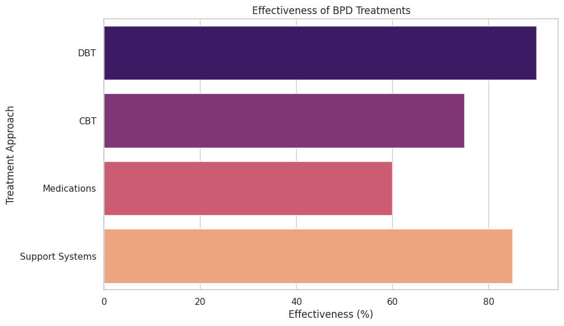
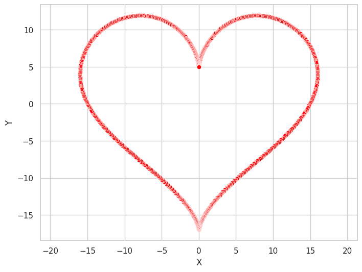

```python
!pip install matplotlib pandas seaborn
```

    Requirement already satisfied: matplotlib in /usr/local/lib/python3.10/dist-packages (3.7.1)
    Requirement already satisfied: pandas in /usr/local/lib/python3.10/dist-packages (2.0.3)
    Requirement already satisfied: seaborn in /usr/local/lib/python3.10/dist-packages (0.13.1)
    Requirement already satisfied: contourpy>=1.0.1 in /usr/local/lib/python3.10/dist-packages (from matplotlib) (1.2.1)
    Requirement already satisfied: cycler>=0.10 in /usr/local/lib/python3.10/dist-packages (from matplotlib) (0.12.1)
    Requirement already satisfied: fonttools>=4.22.0 in /usr/local/lib/python3.10/dist-packages (from matplotlib) (4.53.1)
    Requirement already satisfied: kiwisolver>=1.0.1 in /usr/local/lib/python3.10/dist-packages (from matplotlib) (1.4.5)
    Requirement already satisfied: numpy>=1.20 in /usr/local/lib/python3.10/dist-packages (from matplotlib) (1.25.2)
    Requirement already satisfied: packaging>=20.0 in /usr/local/lib/python3.10/dist-packages (from matplotlib) (24.1)
    Requirement already satisfied: pillow>=6.2.0 in /usr/local/lib/python3.10/dist-packages (from matplotlib) (9.4.0)
    Requirement already satisfied: pyparsing>=2.3.1 in /usr/local/lib/python3.10/dist-packages (from matplotlib) (3.1.2)
    Requirement already satisfied: python-dateutil>=2.7 in /usr/local/lib/python3.10/dist-packages (from matplotlib) (2.8.2)
    Requirement already satisfied: pytz>=2020.1 in /usr/local/lib/python3.10/dist-packages (from pandas) (2024.1)
    Requirement already satisfied: tzdata>=2022.1 in /usr/local/lib/python3.10/dist-packages (from pandas) (2024.1)
    Requirement already satisfied: six>=1.5 in /usr/local/lib/python3.10/dist-packages (from python-dateutil>=2.7->matplotlib) (1.16.0)


```python

from dataclasses import dataclass, field
from typing import List
import pandas as pd
import matplotlib.pyplot as plt
from math import pi
```


```python
# Borderline Personality Disorder (BPD) Analysis

# This notebook provides visualizations to help understand the key concepts related to Borderline Personality Disorder (BPD). The visualizations aim to illustrate the prevalence, symptoms, causes, and impact of BPD using seaborn for aesthetically pleasing and informative charts.


"""
Module for visualizing Borderline Personality Disorder (BPD) data.

This module includes data classes and functions to generate various charts
related to BPD, following best practices and Google's style guide.

Author: Your Name
Date: 2024-07-26
"""

from dataclasses import dataclass, field
import pandas as pd
import seaborn as sns
import matplotlib.pyplot as plt

sns.set_theme(style="whitegrid")

@dataclass
class BPDData:
    """
    A class to represent BPD-related data.

    Attributes:
        symptom_data (pd.DataFrame): DataFrame containing symptoms and their prevalence.
        causes_data (pd.DataFrame): DataFrame containing causes and their impact.
        emotional_data (pd.DataFrame): DataFrame containing emotional states and their frequencies.
        treatment_data (pd.DataFrame): DataFrame containing treatments and their effectiveness.
    """
    symptom_data: pd.DataFrame = field(default_factory=pd.DataFrame)
    causes_data: pd.DataFrame = field(default_factory=pd.DataFrame)
    emotional_data: pd.DataFrame = field(default_factory=pd.DataFrame)
    treatment_data: pd.DataFrame = field(default_factory=pd.DataFrame)

    def to_dataframe(self):
        """
        Converts BPDData attributes to a dictionary of DataFrames.

        Returns:
            dict: A dictionary containing all the data as DataFrames.
        """
        return {
            "symptom_data": self.symptom_data,
            "causes_data": self.causes_data,
            "emotional_data": self.emotional_data,
            "treatment_data": self.treatment_data,
        }

# Sample data for visualizations
symptom_data = {
    "Symptom": [
        "Fear of Abandonment", "Unstable Relationships", "Identity Disturbance",
        "Impulsivity", "Emotional Instability", "Chronic Emptiness",
        "Intense Anger", "Paranoid Ideation"
    ],
    "Percentage": [95, 85, 80, 70, 90, 75, 65, 60]
}

causes_data = {
    "Factor": ["Genetic", "Neurobiological", "Environmental"],
    "Impact": [40, 30, 30]
}

emotional_data = {
    "State": ["Stable", "Dysregulated"],
    "Frequency": [20, 80]
}

treatment_data = {
    "Treatment": ["DBT", "CBT", "Medications", "Support Systems"],
    "Effectiveness": [90, 75, 60, 85]
}

bpd_data = BPDData(
    symptom_data=pd.DataFrame(symptom_data),
    causes_data=pd.DataFrame(causes_data),
    emotional_data=pd.DataFrame(emotional_data),
    treatment_data=pd.DataFrame(treatment_data)
)

def plot_symptom_prevalence(data):
    """
    Plot the prevalence of BPD symptoms.

    Args:
        data (pd.DataFrame): DataFrame containing symptoms and their prevalence.
    """
    plt.figure(figsize=(10, 6))
    sns.barplot(x="Percentage", y="Symptom", data=data, palette="viridis")
    plt.title("Prevalence of BPD Symptoms")
    plt.xlabel("Percentage of Patients Exhibiting Symptom")
    plt.ylabel("BPD Symptom")
    plt.show()

def plot_causes_risk_factors(data):
    """
    Plot the causes and risk factors of BPD.

    Args:
        data (pd.DataFrame): DataFrame containing factors and their impact.
    """
    plt.figure(figsize=(8, 8))
    plt.pie(data["Impact"], labels=data["Factor"], autopct='%1.1f%%', colors=sns.color_palette("pastel"))
    plt.title("Causes and Risk Factors of BPD")
    plt.show()

def plot_emotional_dysregulation(data):
    """
    Plot the frequency of emotional states in BPD.

    Args:
        data (pd.DataFrame): DataFrame containing emotional states and their frequencies.
    """
    plt.figure(figsize=(8, 8))
    plt.pie(data["Frequency"], labels=data["State"], autopct='%1.1f%%', colors=sns.color_palette("coolwarm"))
    plt.title("Emotional Dysregulation in BPD")
    plt.show()

def plot_treatment_effectiveness(data):
    """
    Plot the effectiveness of different BPD treatments.

    Args:
        data (pd.DataFrame): DataFrame containing treatments and their effectiveness.
    """
    plt.figure(figsize=(10, 6))
    sns.barplot(x="Effectiveness", y="Treatment", data=data, palette="magma")
    plt.title("Effectiveness of BPD Treatments")
    plt.xlabel("Effectiveness (%)")
    plt.ylabel("Treatment Approach")
    plt.show()

# Generate and display the plots
plot_symptom_prevalence(bpd_data.symptom_data)
plot_causes_risk_factors(bpd_data.causes_data)
plot_emotional_dysregulation(bpd_data.emotional_data)
plot_treatment_effectiveness(bpd_data.treatment_data)
```

    <ipython-input-3-046e7b1e3132>:93: FutureWarning: 
    
    Passing `palette` without assigning `hue` is deprecated and will be removed in v0.14.0. Assign the `y` variable to `hue` and set `legend=False` for the same effect.
    
      sns.barplot(x="Percentage", y="Symptom", data=data, palette="viridis")


    


    <ipython-input-3-046e7b1e3132>:131: FutureWarning: 
    
    Passing `palette` without assigning `hue` is deprecated and will be removed in v0.14.0. Assign the `y` variable to `hue` and set `legend=False` for the same effect.
    
      sns.barplot(x="Effectiveness", y="Treatment", data=data, palette="magma")


    



```python
import numpy as np
import matplotlib.pyplot as plt
import seaborn as sns

# Generate data points for a heart shape
t = np.linspace(0, 2 * np.pi, 1000)
x = 16 * np.sin(t)**3
y = 13 * np.cos(t) - 5 * np.cos(2*t) - 2 * np.cos(3*t) - np.cos(4*t)

# Create a DataFrame to hold the x and y coordinates
import pandas as pd
data = pd.DataFrame({
    'X': x,
    'Y': y
})

# Use seaborn to plot the heart with a red shade
plt.figure(figsize=(8, 6))
sns.scatterplot(x='X', y='Y', data=data, color="red")
plt.axis('equal')
plt.show()
```




